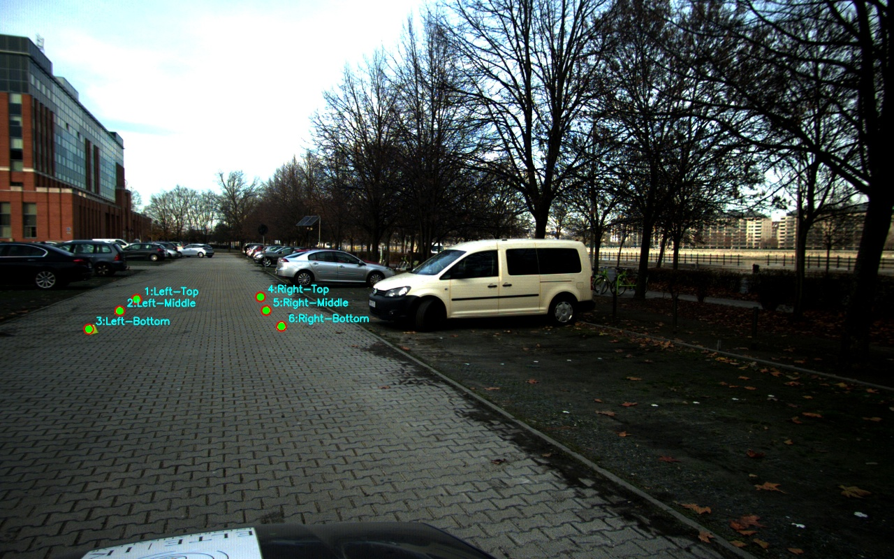
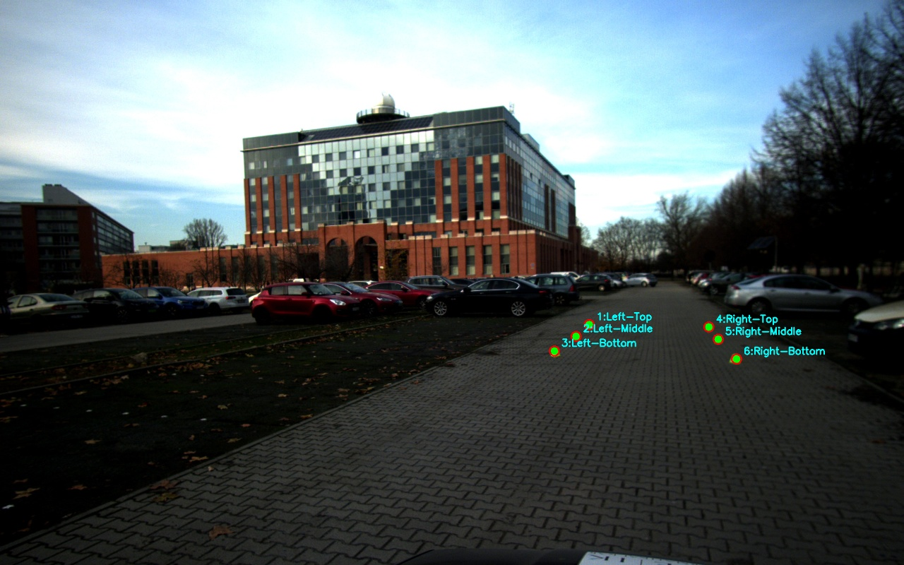
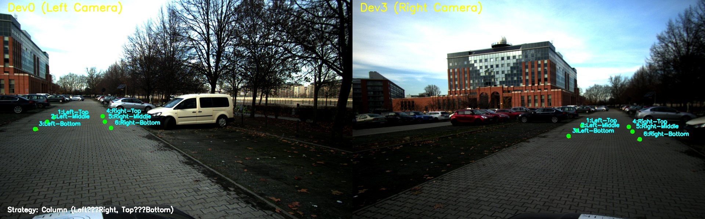

## 🚗 Camera-Based Speedometer Project README

This project implements a camera-based speedometer by calculating the ego-motion of a vehicle using homographies, Bird's-Eye View (BEV) transformation, dense optical flow, and RANSAC-based robust estimation.

-----

## 1\. Project Setup and Dependencies

### 1.1 Virtual Environment

Ensure you are running the project within a virtual environment.

```bash
# Create a virtual environment (if you haven't already)
python -m venv venv

# Activate the virtual environment
# On Windows (PowerShell):
.\venv\Scripts\Activate.ps1
# On macOS/Linux:
source venv/bin/activate
```

### 1.2 Required Libraries

This project relies on **OpenCV** (`cv2`), **NumPy**, **Tqdm**, and **ImageIO**.

```bash
# Install required libraries
pip install opencv-python numpy tqdm imageio
```

### 1.3 Data Structure

Ensure your image data is structured correctly under a `dataset` folder:

```
visual-speed-measurement/
├── dataset/
│   ├── Dev0/
│   │   ├── Dev0_Image_w1920_h1200_fn1.jpg
│   │   ├── Dev0_Image_w1920_h1200_fn2.jpg
│   │   └── ...
│   └── Dev3/
│       ├── Dev3_Image_w1920_h1200_fn1.jpg
│       └── ...
├── annotations/
│   ├── dev0_pts.json  # Annotated marker points
│   └── dev3_pts.json
├── results/ # Generated videos and output data
└── main.py
└── speedometer/
    ├── pipeline_with_world_coords.py
    └── ...
```

-----

## 2\. Configuration and Execution Modes (`main.py`)

The primary execution script, `main.py`, contains a `RUN_MODE` switch to easily control the processing workload.

### 2.1 Fine-Tuning and Stability Parameters ⚙️

The following parameters have been configured in `pipeline_with_world_coords.py` for optimal performance and stability:

| Component | Parameter / Technique | Purpose |
| :--- | :--- | :--- |
| **BEV** | `flags=cv2.INTER_CUBIC` | **Clarity Enhancement:** Uses cubic interpolation for a sharper, clearer Bird's-Eye View image during perspective warping. |
| **Speed** | `ExponentialMovingAverage (α=0.1)` | **Stability:** Applies strong smoothing to the final `speed_kmh` value to reduce temporal jitter. |
| **Motion** | `ExponentialMovingAverage (α=0.2)` | **Stability:** Applies moderate smoothing to the raw RANSAC-derived `translation_px` vector. |
| **Scaling** | `SCALE_PX_PER_M = 150.0` | BEV pixel density set for high detail. |

### 2.2 Selecting the `RUN_MODE`

Modify the `RUN_MODE` variable in `main.py` before running the script.

| `RUN_MODE` | Frame Range | Purpose | Output File |
| :--- | :--- | :--- | :--- |
| **`"FULL"`** | 0 to 3404 | **Final Submission Run.** Processes the entire dataset. | `result_speedometer_full.mp4` |
| **`"HALF1"`** | 0 to 1701 | First half of the frames (for batch processing). | `result_speedometer_part1.mp4` |
| **`"HALF2"`** | 1702 to 3404 | Second half of the frames (for batch processing). | `result_speedometer_part2.mp4` |
| **`"CHUNK"`** | 0 to 99 | **Fast Testing/Debugging.** Runs only the first 100 frames. | `result_speedometer_test_chunk.mp4` |

### 2.3 Running the Script

Execute the pipeline using the activated environment:

```bash
python main.py
```

-----

## 3\. Core Code Functionality (`pipeline_with_world_coords.py`)

The pipeline has been upgraded to ensure robust speed estimation and comprehensive visualization.

### 3.1 Speed and Motion Stability

To address noise inherent in frame-to-frame optical flow estimation, the following stability measures were introduced:

  * **EMA Smoothing:** An **Exponential Moving Average** filter is applied to the calculated **translation vector** and the final **speed** value, resulting in smooth, realistic speed readings.
  * **RANSAC Refinement:** The core translation vector is still derived from a RANSAC-robust fit on the dense optical flow, filtering out outliers caused by moving objects.

### 3.2 Enhanced Visualization (`compose_visual_frame`)

The visualization function has been updated to provide key metrics for analysis:

  * **BEV Clarity:** BEV images are generated using **Cubic Interpolation** for superior detail.
  * **Motion Vector Display:** The **smoothed translation vector** (magnified for visibility) is drawn on the Left BEV panel, originating from the center.
      * **Vector Color:** Yellow/Cyan Arrow.
  * **Status Bar Diagnostics:** The status bar now clearly displays:
    1.  The **Speed (km/h)** (smoothed value).
    2.  The $\mathbf{X}$ and $\mathbf{Y}$ pixel components of the **Smoothed Motion Vector** (`translation_px`).

-----

## 4. Output and Artifacts 💾

### 4.1 Annotation Files

The JSON files containing the annotated image points (used to calculate the initial Homographies $H_0$ and $H_3$) can be found here:

* [annotations/dev0\_pts.json](https://github.com/Raphtildai/visual-speed-measurement/blob/master/annotations/dev0_pts.json)
* [annotations/dev3\_pts.json](https://github.com/Raphtildai/visual-speed-measurement/blob/master/annotations/dev3_pts.json)

### 4.2 Annotated Images 🖼️

These images illustrate the initial setup for homography calculation, showing the manually selected **control points** in the image plane that correspond to known world coordinates.

| Camera | Image | Description |
| :---: | :--- | :--- |
| **Dev0 (Left Camera)** |  | Points selected for the Left Camera (`dev0_pts.json`).  |
| **Dev3 (Right Camera)** |  | Points selected for the Right Camera (`dev3_pts.json`).  |
| **Annotation Comparison (Both Cameras)** |  | Points selected for the Right Camera (`dev3_pts.json & dev3_pts.json`).  |

### 4.3 Generated Videos

The video results generated by the pipeline are saved in the `results/` directory:

* **Test Chunk (100 frames):** [results/result\_speedometer\_test\.mp4](https://github.com/Raphtildai/visual-speed-measurement/blob/master/results/result_speedometer_test.mp4)
* **Full Run (Concatenated):**
    Since the full concatenated video is huge, it wasn't uploaded to github.

---

## 5\. Merging Videos (Batch Processing)

If you run the pipeline using the **`"HALF1"`** and **`"HALF2"`** modes, you must use **FFmpeg** to concatenate the two output video files.

1.  **Run Part 1** and **Run Part 2** (as described in Section 2).

2.  **Create a list file** (`results/file_list.txt`):

    ```
    file 'result_speedometer_part1.mp4'
    file 'result_speedometer_part2.mp4'
    ```

3.  **Execute the FFmpeg command** in your terminal to quickly merge the files without re-encoding:

    ```bash
    ffmpeg -f concat -i results/file_list.txt -c copy results/final_speedometer_full.mp4
    ```